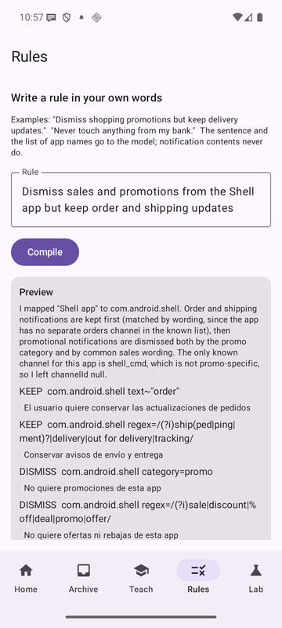
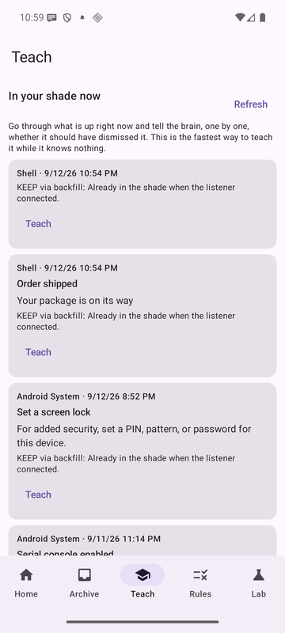
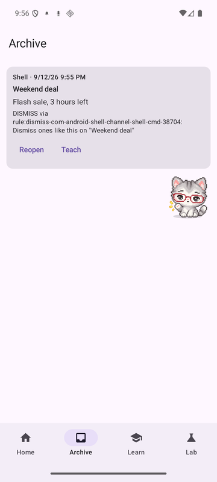

# notification-brain

A notification listener that dismisses the notifications you would have swiped anyway, keeps
every one of them in an archive you can review and undo, and rewrites its own policy from what
you tell it: a chip on one notification, a sentence in your own words, or nothing at all, just
the way you keep swiping. Every new policy is tried against the whole archive before it is adopted.

> Stage 1 of the Evolving App series. The plan is an app that keeps a knowledge base of itself
> and fixes itself when it breaks. That is a ladder, and this is the first rung: an app that
> changes its rules, and carries the test harness it needs to be allowed to.

**Series:** Evolving App (stage 1) · Android × AI · Things Apple Would Never Let Me Do
**Status:** builds; 32 JVM tests pass. On a Galaxy Z Fold 8 (One UI 9.0, Android 17): the
listener binds, every notification is judged and archived, and the one-time-code guard fired on
a real device. On the Android 16 emulator: the chip loop was verified end to end (swipe → Teach
tab → "Dismiss ones like this" → policy v2 → the next notification on that channel dismissed by
the new rule, visible in Archive with Reopen), and so was the typed-rule loop ("Dismiss sales and
promotions from the Shell app but keep order and shipping updates" → four compiled rules with the
KEEP exceptions ordered first → policy v3 → a "Flash sale" already in the shade dismissed on
adoption, "Order shipped" left alone). Not yet measured: the false-dismissal rate over real days
of use. See *What I learned*.

## Why I built this

Two things Android hands to any app the user trusts with notification access, and iOS hands to
nobody: read every notification on the device, and remove any of them. That alone is a novelty.
What makes it an experiment is the third thing, which is easy to miss: when a notification leaves
the shade, the listener is told *why*. The user swiped this one. The user tapped that one. The app
took this one back. Those reasons are free labels, and an app that gets free labels can learn
without asking.

The larger question, and the reason this repository exists at all, is whether an app can change
its own behaviour safely. Notification triage is the smallest real problem I could find where
"safely" has teeth: the one fatal failure is swallowing a one-time code.

## The iOS brain

An iOS developer reads "dismiss other apps' notifications" and starts drafting the App Review
rejection in their head. There is no `NotificationListenerService` equivalent. `UNUserNotificationCenter`
lets an app manage its own notifications. Notification Service and Content extensions run on the
app's own pushes. Focus filters let the system tell an app what to hide, not the other way around.
The closest a third party gets is the Shortcuts app, which cannot read the shade either.

So the iOS brain never asks "what would I do with everyone's notifications", and never gets to the
interesting part: the labels.

## What Android exposes

- `NotificationListenerService`: bound by the system once the user grants notification access.
  `onNotificationPosted` for everything, `cancelNotification(key)` and `snoozeNotification` for
  everything clearable.
- `onNotificationRemoved(sbn, ranking, reason)`: `REASON_CANCEL` (user swiped this one),
  `REASON_CANCEL_ALL`, `REASON_CLICK`, `REASON_APP_CANCEL`, `REASON_LISTENER_CANCEL` and more.
- `ApplicationExitInfo` (API 30+): the system's record of this app's own crashes and ANRs, with
  traces, readable after the fact. Nothing acts on it in stage 1; it is collected because stage 3
  will need the history.

## Experiment

```
posted ──► facts ──► HardKeep guard ──► ordered rules ──► default KEEP
                                            │
                                         DISMISS ──► archive row ──► cancelNotification
removed(reason) ──► outcome on the row (USER_SWIPED / USER_OPENED / ...)

one chip on a card (Archive / Teach) ──► PolicyLearner      ─┐
a sentence on the Rules tab ──► Claude ──► InstructionEditor  ─┼──► candidate policy
three quick swipes, no taps ──► AutoLearner                   ─┘         │
                       PolicyCourt: replay candidate against every archived row with its label
                                                        │
                                   passes ──► adopt        fails ──► refuse, keep the feedback
                                                        │
                                   re-judge the shade, cancel what the new policy dismisses
```

| Rules tab, a sentence compiled and previewed | Teach tab, the shade right now | Archive, with Reopen |
|---|---|---|
|  |  |  |

(Emulator screenshots. The pixel cat in the Archive shot is [cross-app-agent](https://github.com/ioscastaway/cross-app-agent)'s
bubble from another session, not part of this app.)

Three ways to teach it, all ending in the same court:

1. **Chips, one notification at a time.** The *Teach* tab lists what is in the shade right now,
   then what you swiped away one by one. Each card takes one chip: Dismiss ones like this, Always
   dismiss this app, Keep ones like this. The *Archive* tab does the same for what the brain
   dismissed: Good call, Was important, Never touch this app. A chip becomes a rule for that app
   and channel. The optional "why" text is stored with the rule.
2. **A sentence.** The *Rules* tab takes plain language ("쿠팡 광고는 지우고 배송 알림은 남겨",
   "never touch anything from my bank"). Claude compiles it into rules through structured output,
   the app shows the compiled rules for confirmation, and only then are they judged and adopted.
   The sentence is kept verbatim next to its rules and can be removed as a unit.
3. **Nothing.** After a targeted swipe the app checks whether any app + channel has now been
   swiped away quickly three or more times with no taps and no feedback. If so, it proposes a
   DISMISS rule on its own. Observed rules sit after everything you said explicitly.

Whatever the source, a candidate policy is replayed against the archive and refused if it would
have dismissed anything you marked important. On adoption the shade is re-judged immediately, so
the notification you pointed at goes away.

Five tabs: Home (access, today's counts, false dismissals all time), Archive, Teach, Rules, and
Lab (the policy as the app sees it, *Replay against archive*, crash and ANR history, the bundled
`ARCHITECTURE.md`).

The seed policy has no dismiss rules. The brain keeps everything until taught, and the hard-keep
guard (ongoing, not clearable, group summaries, calls, alarms, dialer and system packages,
anything that looks like a one-time code) is code, not policy. No chip, sentence, or observation
can reach it.

## Architecture

`brain/` is pure Kotlin with no Android imports: facts, policy, engine, the three learners
(chips, instructions, observed swipes), the compiler prompt and schema, replay, court. It runs in
JVM tests and inside the app's replay. `platform/` is the only place that touches
`StatusBarNotification`, files, the notification manager, or the Anthropic SDK. `data/` is Room.

The full package map and invariants are in [docs/ARCHITECTURE.md](docs/ARCHITECTURE.md), which
the build bundles as an asset so the running app can show it on the Lab tab next to its own git
revision. That file is the first entry of the knowledge base the later stages read.

## What I learned

- **The removal reason is the whole experiment.** Without `reason` in `onNotificationRemoved` this
  would be a rules engine with a settings screen. With it, the archive labels itself: a targeted
  swipe within ten minutes is noise, a tap is important, "clear all" is nothing.
- **Order of operations matters more than the classifier.** Archive row first, contentIntent
  cached second, cancel third. A crash between steps loses a cancel, never a record.
- **An app cannot run its own tests, so it needs a courtroom.** `PolicyCourt` replays every
  candidate against the labeled history and refuses anything that would have dismissed a
  notification the user marked important. On the JVM this is four tests. On the device it is the
  reason "Dismiss ones like this" can be refused, which the snackbar explains.
- **A sentence compiles better than I expected, with one catch.** Structured output with a strict
  schema meant zero parse failures. Given "keep order and shipping updates" and an app with a
  single channel, the model wrote substring and regex matches instead of guessing a channel, and
  put the KEEP exceptions before the DISMISS on its own because the prompt says first match wins.
  The catch: the first version asked for "because" in the user's language and got Spanish for an
  English sentence; "in the same language the sentence is written in" fixed it.
- **Backfill matters on day one.** Notifications posted before the listener connects never reach
  `onNotificationPosted`. The Teach tab reads `activeNotifications` and gives those a row too,
  otherwise the first thing a new user sees is a shade the brain claims to know nothing about.
- **Shell notifications are enough to verify the loop.** `cmd notification post` from adb posts
  as `com.android.shell`, which the listener treats like any other app. The whole
  swipe → teach → dismiss cycle was driven that way on the emulator.
- **The listener only sees a notification after it is posted.** A heads-up can flash before the
  cancel lands. Doing better needs `NotificationAssistantService`, which is a system role a
  sideloaded app can only take through `adb shell cmd notification allow_assistant`. That is a
  chapter for later, not a footnote.

## iOS comparison

| | Android | iOS |
|---|---|---|
| Read other apps' notifications | `NotificationListenerService`, user-granted | No public API |
| Dismiss other apps' notifications | `cancelNotification(key)` | No public API |
| Learn why a notification went away | `onNotificationRemoved(..., reason)` | No equivalent surface |
| An app rewriting its own rules from feedback | Possible | Possible; this stage is not Android-specific |
| Read the app's own crash history after the fact | `ApplicationExitInfo` | `MetricKit` diagnostics, delivered on the system's schedule |

The stage-1 mechanism (rules that change) is portable. The data it feeds on is not: the difference
is API-level. Apple does not expose the notification shade to third parties at all, so the labels
this app learns from do not exist on iOS.

## Limitations

- **Security and privacy.** Notification access means this app reads the content of every
  notification, including messages and codes. Notification bodies never leave the device: the
  archive lives in app-private storage and is pruned at 60 days. The one network call is the
  Rules tab, and what it sends is the sentence you typed plus the list of app labels, package
  names and channel ids the listener has seen or the launcher lists, so the model can name the
  right app. That list is itself a fingerprint of what you have installed; if that is too much,
  build without an API key and the Rules tab turns itself off while chips and observed learning
  keep working. The hard-keep guard never dismisses calls, alarms, ongoing notifications, or
  one-time codes, and no learner can reach it. Dismissing removes a notification from the shade
  only; nothing in the source app is deleted or marked read.
- **The API key is baked into the debug build** from `local.properties`, which is the right shape
  for a sideloaded experiment on a phone its owner controls and the wrong shape for anything
  shipped.
- **Undo is partial.** A `PendingIntent` cannot be persisted. *Reopen* works fully while the
  listener process is alive and degrades to launching the app after a restart.
- **Heads-up flash.** See *What I learned*.
- **Sideloading on Android 13+.** Notification access is a restricted setting for sideloaded apps.
  Install with the installer recorded as Play (`adb install -i com.android.vending`) or clear the
  restriction in App info, and on an emulator just run
  `adb shell cmd notification allow_listener com.ioscastaway.notificationbrain/.platform.BrainNotificationListener`.
- **Samsung.** One UI has its own notification settings on top of Android's. Whether the listener
  stays bound across days of battery optimisation is not yet measured.
- **The false-dismissal rate is the result, and it is not in yet.** This README will get a table
  after a few weeks of real use.

## Setup

Optional, for the Rules tab: put `ANTHROPIC_API_KEY=...` in `local.properties`.

```bash
./gradlew assembleDebug
./gradlew testDebugUnitTest
adb install -i com.android.vending -r app/build/outputs/apk/debug/app-debug.apk
```

Then Settings → Notifications → Device & app notifications → Notification Brain, or the *Open
settings* button on the Home tab.

## Verdict

Useful already in the narrow sense: the loop works and the guard held on a real device. Whether
it is useful in the wide sense depends on one number, false dismissals per week, which needs weeks.
As an experiment in an app changing itself, the interesting result is structural: the replay
harness is what makes the rewrite safe, and it will outlive the rules it currently protects.

## Next

- **Stage 1.5**: a nightly `PolicyReviser` that reads the instructions, the chips, the "why"
  notes, and per-app statistics (never notification bodies), rewrites the policy as a whole, and
  goes through the same court. The Rules tab is the first half of it: the compiler prompt, the
  schema, and the court are already there.
- **Stage 2**: the classifier behind `NotificationClassifier` becomes a loaded module.
- **Stage 3**: `CrashRecord` + `ARCHITECTURE.md` + `BuildConfig.GIT_SHA` become the input of an
  app that opens a pull request on itself.

---

**Reason #08 I don't regret switching to Android:**
The phone's notifications are a data source, not just a distraction.
